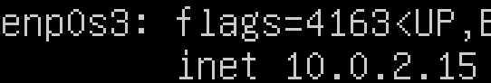

# Операционные системы UNIX/Linux 

## Part 1. Установка ОС

Установил **Ubuntu 20.04 Server LTS** без графического интерфейса. (Использую VirtualBox).
Проверяю версию Ubuntu: 

## Part 2. Создание пользователя 

Создаю нового пользователя vasyaPupkin:

Добавил нового пользователя в группу adm с помощью команду usermod -aG adm. Проверка: 

Вывод команды cat /etc/passwd:

## Part3. Настройка сети ОС

#### 3.1 Задаю название для машины вида user-1:

#### 3.2 Устанавливаем временную зону, соответствующую текущему местоположению

Устанавливаю временную зону timedatectl set-timezone Europe/Moscow

#### 3.3 Выводим названия сетевых интерфейсов

lo (loopback device) – виртуальный интерфейс, присутствующий по умолчанию в любом Linux. Он используется для отладки сетевых программ и запуска серверных приложений на локальной машине. С этим интерфейсом всегда связан адрес 127.0.0.1. У него есть dns-имя – localhost.

#### 3.4 Использую консольную команду, получаем ip адрес устройства, на котором работаем от DHCP сервера

DHCP (англ. Dynamic Host Configuration Protocol — протокол динамической настройки узла) — прикладной протокол, позволяющий сетевым устройствам автоматически получать IP-адрес и другие параметры, необходимые для работы в сети TCP/IP. Данный протокол работает по модели «клиент-сервер». Для автоматической конфигурации компьютер-клиент на этапе конфигурации сетевого устройства обращается к так называемому серверу DHCP и получает от него нужные параметры. Сетевой администратор может задать диапазон адресов, распределяемых сервером среди компьютеров. Это позволяет избежать ручной настройки компьютеров сети и уменьшает количество ошибок. Протокол DHCP используется в большинстве сетей TCP/IP.

#### 3.5. Определяем и выводим на экран внешний ip-адрес шлюза (ip) и внутренний IP-адрес шлюза, он же ip-адрес по умолчанию (gw)

#### 3.6 Задаем статичные настройки ip, gw, dns

Перехожу к файлу конфигурации vim /etc/netplan/00-installer-config.yaml, вношу необходимые изменения

Проверяю

## Part4. Обновление ОС

Обновил системные пакеты до последней версии 

## Part5. Использование команды sudo.

Я добавил пользователя ****vasyaPupkin**** в группу sudo и уже через него поменял hostname

## Part6. Установка и настройка службы времени

Вывожу врем по моему часовому поясу и проверяю службу синхронизации времени

## Part 7. Установка и использование текстовых редакторов

Создаю файл test_VIM.txt(команда vim test_VIM.txt) и записываю в него свой ник:

Про vim есть шутка: мой друг уже 8 лет успешно пользуется vim, потому что не знает как из него выйти. Чтобы выйти из vim надо нажать поочередно esc, :, w, q, enter

Создаю с помощью редактора nano файл nano test_NANO.txt и записываю в него свой ник:

 Чтобы выйти нажимаю  ^ + x, Y, enter.
 
 Создаю следующий файл с помощью редактора joe и записываю в него свой ник
 
 
 
 Выход из редактора - ^ + k + q. Согласие с сохранением - y.
 
 Захожу в файл test_VIM.txt с помощью vim. Нажимаю на i, чтобы войти режим ввода, меняю текст файла. Затем нажимаю на esc, чтобы выйти из этого режима и :q!, чтобы выйти без сохранения.
 
 Проверяю, что текст не изменился:
 
 
 
 Захожу в файл test_NANO.txt с помощью редактора nano. Меняю текст, нажимаю на ctrl + x, чтобы выйти из редактора и n, чтобы не сохранять изменения.
 
 Проверяю, что ничего не изменилось:
 
 
 
 Захожу в послений файл с помощью редактора joe и меняю содержимое.
 
 ctrl + k + q - выйти из редактор. n - не сохранять изменения.
 
 Проверяю:
 
 
 
 Нахожу в файле нужное слово:
 
 
 
 Меняю мой ник на выражение:
 
 
 
Захожу с помощью nano в test_NANO.txt.

ctrl + w - поиск слова и переход к нему.

Есть несколько опций для замены текста, но я воспльзовался самым очевидным.

ctrl + \ - замена одного регулярного выражения на другое:

Теперь делаю то же самое с joe.

ctrl + k, f - поиск

Чтобы заменить один текста другой нужно , нужно сделать то же самое в начале, но в конце вместо повторного нажатия на enter, ввести r.

## Part 8 Установка и базовая настройка сервиса SSHD

#### 8.1 Установка службы SSHd

Устанавливаю SSHd с помощью конмады sudo apt install openssh-server

#### 8.2 Добавление автостарта службы при загрузке системы

Добавляю автозапуск службы командой sudo systemctl enable ssh

Проверяю, работает ли служба systemctl status ssh

#### 8.3 Перенастраиваю службы SSHd на порт 2022

Пишу команду sudo vim /etc/ssh/sshd_config и ввожу изменения

#### 8.4 Показываю наличие процесса sshd.

ps -e - показывает все запущенные процессы

Перезагружаю машину и проверяю вывод команды netstat -tan:

netstat - отображение статистики сетевых соединений.

-tan:
-a - Показывать состояние всех сокетов; обычно сокеты, используемые серверными процессами, не показываются
-n - Показывать сетевые адреса как числа. netstat обычно показывает адреса как символы
-t - Отображать TCP подключения
Proto - Содержит тип протокола
Recv-Q - Счётчик байтов не скопированных программой пользователя из этого сокета
Send-Q - Счётчик байтов, не подтверждённых удалённым узлом
Local Address - Адрес и номер порта локального конца сокета
Foreign Address - Адрес и номер порта удалённого конца сокета
State - Состояние сокета
LISTEN - Сокет ожидает входящих подключений
SYN_SENT - Сокет, находящийся в режиме активной попытки установки подключения
0.0.0.0 - Немаршрутизируемый адрес IPv4, который используется в качестве адреса по умолчанию или адреса-заполнителя

## Part 9. Установка и использование утилит top, htop

#### 9.1 Запускаю утилиу top

uptime - 6 min
количество авторизованных пользователей - 1
общую загрузку системы - 0.00, 0.02, 0.00
общее количество процессов - 95 total
загрузку cpu - 0.0 Us, 0.0 sY, 0.0 n1, 100.0 id, 0.0 ma, 0.0 hi, 0.0 si, 0.0 st
загрузку памяти - 1971.6 total, 1590.4 free, 141.2 used, 240.0 buff/cache
pid процесса занимающего больше всего памяти - 664 (находясь в топ нужно нажать на M, чтобы отсортировать процессы по памяти)
pid процесса, занимающего больше всего процессорного времени - 391

#### 9.2 Запускаю утилиту htop

Сортирую по PID: 

Сортирую по PERCENT_CPU:

Сортирую по PERCENT_MEM:

Сортирую по TIME:

 

Фильтрую для процесса sshd:

с процессом syslog, найденным, используя поиск:

с добавленным выводом hostname, clock и uptime:

## Part 10 fdisk

#### Запускаю fdisk -l:

название жесткого диска: VBOX HARDDISK

размер: 25 GiB

количество секторов: 52428800

Размер swap: 2.0 GiB

## Part 11. Использование утилиты df

#### 11.1 Запускаю команду df

Для корневого раздела(/):
размер раздела: 11758760
размер занятого пространства: 4763740
размер свободного пространства: 6375912
процент использования: 43%
Единица измерения: 1k

#### 11.2 Запускаю команду df -Th

Для корневого раздела(/):
размер раздела: 12G
размер занятого пространства: 4.6G
размер свободного пространства: 6.1G
процент использования: 43%

Тип файловой системы для раздела: ext4

## Part 12. Использование утилиты du

#### 12.1 Запускаю команду du:

#### 12.2 Вывод размера папок /home, /var, /var/log (в байтах, в человекочитаемом виде)

Использую флаги и запускаю du -sh /home /var /var/log:

#### 12.3 Вывожу размер всего содержимого в /var/log (не общее, а каждого вложенного элемента, используя *)

Запускаю команду du -sh /var/log/*

## Part 13. Установка и использование утилиты ncdu

#### 13.1 Устанавливаю утилиту с помощью sudo apt install ncdu

#### 13.2 Вывожу размер папок /home, /var, /var/log

Вывожу размер папки /home sudo ncdu /home:

Вывожу размер папки var (sudo ncdu /var):

Вывожу размер папки var/log

## Part 14. Работа с системными журналами

Открываю для просмотра sudo cat /var/log/dmesg

dmesg — в этом логе хранится информация о загрузке ядра и драйверов оборудования. В момент загрузки системы записывается вся основная информация, имеющая к ней отношение.

Открываю для просмотра vim /var/log/syslog

syslog - глобальные системные журналы операционной системы linux. Сюда пишутся события загрузки, ядра системы, системы инициализации systemd и т.д.

Открываю для просмотра vim /var/log/auth.log

auth.log — лог авторизации и аутентификации в системе, в том числе ssh.

Время последней успешной авторизации - 22:38:34
Имя пользователя - rauthade
Метод входа в систему - TTY=tty1

Перезапускаю sshd systemctl restart sshd

Логи о перезапуске sshd:

## Part 15. Использование планировщика заданий CRON

Cron (Command Run ON) — система для автоматического запуска программ и скриптов на сервере в определённое время.

#### 15.1 Используя планировщик заданий, запускаю команду uptime через каждые 2 минуты

Вхожу в журнал для записи заданий crontab -e и добавляю задание */2 * * * * uptime

Смотрю логи vim /var/log/syslog:

Вывожу список текущих заданий для cron (crontab -l):

Удаляю все задачи (crontab -r) и вывожу все текущие задачи:

