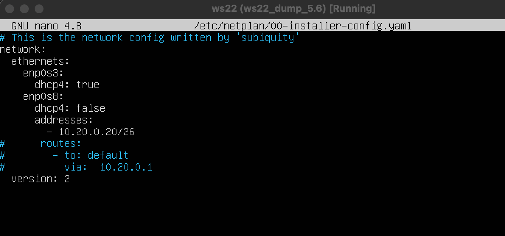

# Сети в Linux

Настройка сетей в Linux на виртуальных машинах.


## Contents

1. [Chapter I](#chapter-i)
2. [Chapter II](#chapter-ii) \
   2.1. [Стек протоколов TCP IP](#стек-протоколов-tcp-ip) \
   2.2. [Адресация](#адресация) \
   2.3. [Маршрутизация](#маршрутизация)
3. [Chapter III](#chapter-iii) \
   3.1. [Инструмент ipcalc](#part-1-инструмент-ipcalc) \
   3.2. [Статическая маршрутизация между двумя машинами](#part-2-статическая-маршрутизация-между-двумя-машинами) \
   3.3. [Утилита iperf3](#part-3-утилита-iperf3) \
   3.4. [Сетевой экран](#part-4-сетевой-экран) \
   3.5. [Статическая маршрутизация сети](#part-5-статическая-маршрутизация-сети) \
   3.6. [Динамическая настройка IP с помощью DHCP](#part-6-динамическая-настройка-ip-с-помощью-dhcp) \
   3.7. [NAT](#part-7-nat) \
   3.8. [Допополнительно. Знакомство с SSH Tunnels](#part-8-дополнительно-знакомство-с-ssh-tunnels)
4. [Chapter IV](#chapter-iv)


## Part 1. Инструмент **ipcalc**
часть.пункт.подпункт.нумерация задания.нумирация выполнения.номер скриншота

##### Подними виртуальную машину (далее -- ws1)
   - создаём новую виртуальную машину ws1 \
   .png)
   .png)

#### 1.1. Сети и маски
- ipcalc - вычисляет широковещательный адрес, диапазон хостов, шаблон сетевой маски по полученному IP и сетевой маске. Может использоваться для конструирования сетей (network) и подсетей, а также в обучающих целях.
Опции:
-n —nocolor Подавить вывод цветов.
-b —nobinary Подавить поразрядный вывод.
-c —class Показать маску сети по адресу.
-h —html Показать результаты в HTML.
-v —version Показать версию программы.
-s —split n1 n2 n3 Разделить сети по размеру n1, n2, n3.
-r —range Исключить диапазон адресов .
—help —Помощь.
##### Определи и запиши в отчёт:
##### 1) Адрес сети *192.167.38.54/13*
   1. устанавливаем утилиту ipcalc командой sudo apt install ipcalc;
   .png)
   2. узнаём адрес сети командой: ipcalc 192.167.38.54/13.
   .png)

##### 2) Перевод маски *255.255.255.0* в префиксную и двоичную запись, */15* в обычную и двоичную, *11111111.11111111.11111111.11110000* в обычную и префиксную
1. командой ipcalc 192.167.38.54/255.255.255.0 узнаём префиксную и двоичную форму маски;
   255.255.255.0/24 - префиксная форма
   11111111.11111111.11111111.00000000 - двоичная форма

2. командой ipcalc 192.167.38.54/15 узнаём десятичную(обычную) и двоичную форму маски;
   255.254.0.0 - десятичная(обычная) форма;
   11111111.11111110.00000000.00000000 - двоичная форма
   
3. - данную нам маску 11111111.11111111.11111111.11110000 пересчитываем в префиксную форму
     для этого из 32 (т.к. вся маска это 32 бита) отнимаем 4 бита(последние 4 нуля) получаем 28;
   - командой ipcalc 192.167.38.54/28 применяем полученную префиксную форму к айпи адресу и 
     получаем двоичную (бинарную) форму.
     
   - (необязательно) также наложив данную нам маску 11111111.11111111.11111111.11110000 на 
     ip 192.167.38.54 
     можем вычислить десятичную форму маски. Для этого обратим внимание на первые 24 бит заполненные 1, 8 бит заполненные 1 - это число 255, соответственно первые 3 байта (1 байт = 8 бит) нашей маски это: 255.255.255. 
     
     Обратим внимание на последний байт (8 бит) маски, 4 бита из которого заполнены 1, а последние 4 заполнены 0. 11110000 - будет равно (с конца) = 0(первый бит 0 отвечает за 1) + 0(второй бит 0 отвечает за 2) + 0 (третий бит 0 отвечает за 4) + 0 (четвёртый бит 0 отвечает за 8) + 16(пятый бит 1 отвечает за 16) + 32(6 бит 1 отвечает за 32) + 64 (седьмой бит 1 отвечает за 64) + 128 (8й бит 1 отвечает за 128) = 240.
     Т.к. 1 бит может записать два числа или 0 или 1, два бита 4 числа, 3 бита 8 чисел и т.д. до 8 бита. 
     Т.е. начиная с конца, где первый бит 1 каждый последующий бит умножается на 2 и после этого все полученные числа складываются. Максимально возможное число получаемое из 8 бит это 255.  1(128)+1(64)+1(32)+1(32)+1(16)+1(8)+1(4)+1(2)+1(1) = 8 бит (255 десятичная форма или 11111111 - двоичная(бинарная) форма). 
     Соответственно, в бинарном числе, на месте где у нас стоит единица, для перевода в десятичную форму мы подставляем число за которое оно отвечает и складываем с другими числами полученное из других единиц.
.png)

##### 3) Минимальный и максимальный хост в сети *12.167.38.4* при масках: */8*, *11111111.11111111.00000000.00000000*, *255.255.254.0* и */4*
   1. командой ipcalc 12.167.38.4/8 узнаём минимальный и максимальный хост:
      - Hostmin: 12.0.0.1.
      - Hostmax: 12.255.255.254
      также 2 зарезервированных хоста:
      - Network: 12.0.0.0
      - Broadcast: 12.255.255.255
      всего возможных подключений хостов(кроме 2х зарезервированных):
      - Hosts/Net: 16777214
      обратный ip адрес (используется для вычисления внутреннего ip(до маршрутизатора)):
      - Wildcard: 0.255.255.255
   2. Вычисляем десятичную (255.255.0.0) или префиксную (16) форму данной нам маски 11111111.11111111.00000000.00000000 и  
      используя команду ipcalc 12.167.38.4/255.255.0.0 или 12.167.38.4/16 узнаём минимальный и максимальный хост:
      - Hostmin: 12.167.0.1
      - Hostmax: 12.255.255.254
   3. командой ipcalc 12.167.38.4/255.255.254.0 узнаём минимальный и максимальный хост:
      - Hostmin: 12.167.38.1
      - Hostmax: 12.167.39.254
   .png)

   4. командой ipcalc 12.167.38.4/4 узнаём минимальный и максимальный хост:
      - Hostmin: 0.0.0.1.
      - Hostmax: 15.255.255.254
   .png)

#### 1.2. localhost
##### Определи и запиши в отчёт, можно ли обратиться к приложению, работающему на localhost, со следующими IP: *194.34.23.100*, *127.0.0.2*, *127.1.0.1*, *128.0.0.1*
   lo (loopback device) – виртуальный интерфейс, присутствующий по умолчанию в любом Linux. Он используется для отладки сетевых программ и запуска серверных приложений на локальной машине. С этим интерфейсом всегда связан адрес 127.0.0.1. У него есть dns-имя – localhost.
   ip и mask localhost:
   - 127.0.0.1        127.0.0.1      255.0.0.0       UH        3584 0          0 lo
   - 128.17.75.20     127.0.0.1      255.255.255.0   UH        3584 0          0 lo
   - командой ipcalc <данные нам айпи> смотрим в выводе команды, есть ли в последней строчке, после класса, надпись loopback, если такое значение присутствует можно сделать вывод, что сигнал с localhost дошёл до хоста и вернулся обратно, из этого следует, что к данному хосту можно обратиться с localhost;  
   - также можно командой ipcalc 127.0.0.1/255.0.0.0 проверяем входят ли данные нам айпи в диапазон HostMin/Max.
   
   194.34.23.100 - нельзя обратиться;
   127.0.0.2 - можно обратиться;
   127.1.0.1 - можно обратиться;
   128.0.0.1 - нельзя обратиться.

   .png)
   .png)

#### 1.3. Диапазоны и сегменты сетей
##### Определи и запиши в отчёт:
##### 1) Какие из перечисленных IP можно использовать в качестве публичного, а какие только в качестве частных: *10.0.0.45*, *134.43.0.2*, *192.168.4.2*, *172.20.250.4*, *172.0.2.1*, *192.172.0.1*, *172.68.0.2*, *172.16.255.255*, *10.10.10.10*, *192.169.168.1*

      Публичные «белые» IP-адреса. Публичный IP-адрес чаще называют «белым». С его помощью устройство может беспрепятственно выходить в интернет и общаться с другими устройствами, которые также обладают белым IP-адресом.

      Частные «серые» IP-адреса. Частный, или «серый», IP-адрес используется в локальных сетях. С таким адресом устройство может общаться с другими устройствами, только если они находятся в той же локальной сети.

      Также в случае публичного Ip после класса может ничего не указываться.

- командой ipcalc <данные нам IP> в последней строке вывода команды после класса будет написано тип сети: 

   10.0.0.45 - приватный;
   134.43.0.2 - публичный;
   192.168.4.2 - приватный;

   .png)

   172.20.250.4 - приватный;
   172.0.2.1 - публичный;
   192.172.0.1 - публичный;

   .png)

   172.68.0.2 - публичный;
   172.16.255.255 - приватный;
   10.10.10.10 - приватный;
   .png)

   192.169.168.1 - публичный.
   .png)


##### 2) Какие из перечисленных IP адресов шлюза возможны у сети *10.10.0.0/18*: *10.0.0.1*, *10.10.0.2*, *10.10.10.10*, *10.10.100.1*, *10.10.1.255*

- командой ipcalc 10.10.0.0/18 проверяем входят ли в диапазон HostMin/Max наши айпи:

   10.0.0.1 - возможен;
   10.10.0.2 - возможен;
   10.10.10.10 - возможен;
   10.10.100.1 - не возможен;
   10.10.1.255 - возможен.

   .png)

## Part 2. Статическая маршрутизация между двумя машинами


##### Подними две виртуальные машины (далее -- ws1 и ws2).
   .png)

##### С помощью команды `ip a` посмотри существующие сетевые интерфейсы.
- В отчёт помести скрин с вызовом и выводом использованной команды.

   ws1:
   .png)

   ws2:
   .png)

##### Опиши сетевой интерфейс, соответствующий внутренней сети, на обеих машинах и задать следующие адреса и маски: ws1 - *192.168.100.10*, маска */16*, ws2 - *172.24.116.8*, маска */12*.
- В отчёт помести скрины с содержанием изменённого файла *etc/netplan/00-installer-config.yaml* для каждой машины.

- вносим изменения в конфигурационный файл сети командой: sudo nano /etc/netplan/00-installer-config.yaml
   
   ws1:
   .png)

   ws2:
   .png)

##### Выполни команду `netplan apply` для перезапуска сервиса сети.

- принимаем изменения в конфигурационном файле сети командой: netplan apply
- В отчёт помести скрин с вызовом и выводом использованной команды.

   ws1:
   .png)

- проверяем изменения командой ip a:
   .png)

   ws2:
   .png)

- проверяем изменения командой ip a:
   .png)


смена нейминга скринов: 
part_номер(название)


#### 2.1. Добавление статического маршрута вручную
##### Добавь статический маршрут от одной машины до другой и обратно при помощи команды вида `ip r add`.
##### Пропингуй соединение между машинами.
- В отчёт помести скрин с вызовом и выводом использованных команд.
командой: sudo ip r add <Ip машины> dev enp0s8 прокладываем маршруты между мажду машинами
ко мандой: ping <ip машины> или ping -с 3 <ip машины> проверяем связь между машинами
   ws1:
   .png)

   ws2:
   .png)


#### 2.2. Добавление статического маршрута с сохранением
##### Перезапусти машины.
##### Добавь статический маршрут от одной машины до другой с помощью файла *etc/netplan/00-installer-config.yaml*.
- В отчёт помести скрин с содержанием изменённого файла *etc/netplan/00-installer-config.yaml*.
   ws1:
   .png)
   .png)

   ws2:
   .png)
   .png)

##### Пропингуй соединение между машинами.
- В отчёт помести скрин с вызовом и выводом использованной команды.
   ws1:
   .png)

   ws2:
   .png)

## Part 3. Утилита **iperf3**

#### 3.1. Скорость соединения
##### Переведи и запиши в отчёт: 8 Mbps в MB/s, 100 MB/s в Kbps, 1 Gbps в Mbps.

8 Mbps = 1 MB/s
100 MB/s = 819200 Kbps 
1 Gbps = 1024 Mbps

#### 3.2. Утилита **iperf3**
##### Измерь скорость соединения между ws1 и ws2.
- В отчёт помести скрины с вызовом и выводом использованных команд.
https://losst.pro/kak-polzovatsya-iperf
Утилита iperf - это генератор сетевого трафика, предназначенный для проверки скорости и пропускной способности сети.

Поскольку утилита имеет как серверную часть так и клиентскую, надо рассматривать обе отдельно. Для запуска сервера используется такой синтаксис:
$ iperf3 -s опции

Для запуска клиента используется ключ -c, которому надо передать адрес сервера:
$ iperf3 -c адрес_сервера опции

общие опции программы:

-p, --port - указать порт для сервера или к какому порту надо подключаться;
-f, --format - формат выводимых данных, доступны значения: k,m,g,t,K,M,G,T;
-i, --interval - интервал времени между выводами результата тестирования;
-F, --file - использовать данные из файла вместо генерации случайных данных;
-V, --verbose - вывод максимально подробной информации;
-J, --json - вывод в формате JSON;
--logfile - записывать информацию в лог файл;
--forceflush - очищать историю вывода перед выводом следующего результата тестирования;
-v, --version - версия программы.


- командой:  sudo apt install iperf3 устанавливаем утилиту iperf
- командой: iperf3 -sf M 172.24.116.8 запускаем на машине ws1 как сервер
   .png)

- командой: iperf3 -с 192.168.100.10 запускаем на машине ws2 как как клиент
   .png)

## Part 4. Сетевой экран
#### 4.1. Утилита **iptables**
##### Создай файл */etc/firewall.sh*, имитирующий фаерволл, на ws1 и ws2:
``` https://losst.pro/nastrojka-iptables-dlya-chajnikov
shell
#!/bin/sh

# Удаление всех правил в таблице «filter» (по-умолчанию).
iptables -F
iptables -X
iptables [-t таблица] 
$ iptables -t таблица действие цепочка дополнительные_параметры

Теперь давайте рассмотрим параметры iptables, таблица указывает таблицу, с которой нужно работать, этот параметр можно упустить, действие - нужное действие, например, создать или удалить правило, а дополнительные параметры описывают действие и правило, которое нужно выполнить.

Осталось рассмотреть основные действия, которые позволяет выполнить iptables:

-A - добавить правило в цепочку;
-С - проверить все правила;
-D - удалить правило;
-I - вставить правило с нужным номером;
-L - вывести все правила в текущей цепочке;
-S - вывести все правила;
-F - очистить все правила;
-N - создать цепочку;
-X - удалить цепочку;
-P - установить действие по умолчанию.
Дополнительные опции для правил:

-p - указать протокол, один из tcp, udp, udplite, icmp, icmpv6,esp, ah, sctp,
mh;
-s - указать ip адрес устройства-отправителя пакета;
-d - указать ip адрес получателя;
-i - входной сетевой интерфейс;
-o - исходящий сетевой интерфейс;
-j - выбрать действие, если правило подошло.
```

##### Нужно добавить в файл подряд следующие правила:
##### 1) На ws1 примени стратегию, когда в начале пишется запрещающее правило, а в конце пишется разрешающее правило (это касается пунктов 4 и 5).
##### 2) На ws2 примени стратегию, когда в начале пишется разрешающее правило, а в конце пишется запрещающее правило (это касается пунктов 4 и 5).
##### 3) Открой на машинах доступ для порта 22 (ssh) и порта 80 (http).
##### 4) Запрети *echo reply* (машина не должна «пинговаться», т.е. должна быть блокировка на OUTPUT).
##### 5) Разреши *echo reply* (машина должна «пинговаться»).
- В отчёт помести скрины с содержанием файла */etc/firewall* для каждой машины.

   ws1:
   .png)
   ws2:
   .png)


##### Запусти файлы на обеих машинах командами `chmod +x /etc/firewall.sh` и `/etc/firewall.sh`.
- В отчёт помести скрины с запуском обоих файлов;
- В отчёте опиши разницу между стратегиями, применёнными в первом и втором файлах.

   ws1:
   .png)
   ws2: 
   .png)

Разница заключается в порядке команд, утилита iptables выполняет первое прочитанное правило, соответсвенно на ws1 будет выполнятся запрет(DROP) и пинг не пройдет, а на ws2 наоборот, первым стоит ACCEPT, значит разрешить прохождение пакета, пинг пройдет.

#### 4.2. Утилита **nmap**
##### Командой **ping** найди машину, которая не «пингуется», после чего утилитой **nmap** покажи, что хост машины запущен.
*Проверка: в выводе nmap должно быть сказано: `Host is up`*.
- В отчёт помести скрины с вызовом и выводом использованных команд **ping** и **nmap**.

ws1:
   .png)
   ws2:
   .png)

##### Сохрани дампы образов виртуальных машин
ws1:
.png)

ws2:
.png)

## Part 5. Статическая маршрутизация сети

> `Warning!!! В будущих заданиях для связи с интернетом с машин (ws11, ws21, ws22) и обновления/скачивания пакетов програм, необходимо комментировать дефолтные адреса в конфигурационном файле сети (как на скрине) `

   


##### Подними пять виртуальных машин (3 рабочие станции (ws11, ws21, ws22) и 2 роутера (r1, r2)).
- создаём новые машины
 
   .png)

- в настройках добавляем адаптеры(сети) и прописываем связи согласно рисунку из задания.
   всем машинам прописываем 1 адаптер NAT для выхода в интернет, 
   для машин будет дополнительно 1 внутренняя сеть для связи со своим роутером, для роутеров будет дополнительно две сети, для связи с машинами и другим роутером.

   - у машины ws11 будет две сети(адаптера): NAT и intnet_1
 
   .png)

   - у машин ws21 и ws22 будет две сети(адаптера): NAT и intnet_3
 
   .png)
 
   .png)

   - у роутера r1 будет три сети(адаптера): NAT, intnet_1(для связи с машиной), intnet_2(для связи с роутером)
 
   .png)

   - у роутера r1 будет три сети(адаптера): NAT, intnet_2(для связи с роутером), intnet_3(для связи с машинами)
 
   .png)
 
   .png)

- запускаем машины; 
   1. создаём пользователя (sudo useradd -m admin1); 
   2. добавляем права sudo (sudo usermod -aG sudo admin1);
   3. меняем имя hostname на (ws11, ws21, ws21, r1, r2);
   4. перезагружаем машины (reboot now).

#### 5.1. Настройка адресов машин
##### Настрой конфигурации машин в *etc/netplan/00-installer-config.yaml* согласно сети на рисунке.
В отчёт помести скрины с содержанием файла *etc/netplan/00-installer-config.yaml* для каждой машины.

- командой sudo nano /etc/netplan/00-installer-config.yaml настраиваем конфигурационный файл сети у каждой машины
- командой sudo netplan apply принимаем изменения в настройках

   ws11:
   .png)

   ws21:
   .png)

   ws22:
   .png)

   r1:
   .png)

   r2:
   .png)

##### Перезапусти сервис сети. Если ошибок нет, то командой `ip -4 a` проверь, что адрес машины задан верно. Также пропингуй ws22 с ws21. Аналогично пропингуй r1 с ws11.
- В отчёт помести скрины с вызовом и выводом использованных команд.
- командой ip -4 a проверяем адреса машин
- командой: ping -c 4 10.10.0.1 и ping c ws11 пингуем r1 и командой: -c 4 10.20.0.20 c ws21 пингуем ws22

   ws21:
   .png)

   ws11:
   .png)

#### 5.2. Включение переадресации IP-адресов
##### Для включения переадресации IP, выполни команду на роутерах:
`sysctl -w net.ipv4.ip_forward=1`
*При таком подходе переадресация не будет работать после перезагрузки системы.*
В отчёт помести скрин с вызовом и выводом использованной команды.
- командой: sudo sysctl -w net.ipv4.ip_forward=1 включаем переадресацию на роутерах
   
   r1:
   .png)

   r2:
   .png)

##### Открой файл */etc/sysctl.conf* и добавь в него следующую строку:
`net.ipv4.ip_forward = 1`
*При использовании этого подхода, IP-переадресация включена на постоянной основе.*
В отчёт помести скрин с содержанием изменённого файла */etc/sysctl.conf*.
- командой: sudo nano /etc/sysctl.conf за ходим в файл и раскомментируем строку forward
   
   r1:
   .png)

   r2:
   .png)


#### 5.3. Установка маршрута по-умолчанию
Пример вывода команды `ip r` после добавления шлюза:
```
default via 10.10.0.1 dev eth0
10.10.0.0/18 dev eth0 proto kernel scope link src 10.10.0.2
```
##### Настрой маршрут по-умолчанию (шлюз) для рабочих станций. Для этого добавь `default` перед IP роутера в файле конфигураций.
- В отчёт помести скрин с содержанием файла *etc/netplan/00-installer-config.yaml*;

- меняем конфигурацию сети командой sudo nano /etc/netplan/00-installer-config.yaml

   ws11:
   .png)

   ws21:
   .png)

   ws22:
   .png)


##### Вызови `ip r` и покажи, что добавился маршрут в таблицу маршрутизации.
 В отчёт помести скрин с вызовом и выводом использованной команды.
- командой ip r посказываем, что маршрут добавился в таблицу маршрутизации (строчка default)

   ws11:
   .png)

   ws21:
   .png)

   ws22:
   .png)


##### Пропингуй с ws11 роутер r2 и покажи на r2, что пинг доходит. Для этого используй команду:
`tcpdump -tn -i eth0`
В отчёт помести скрин с вызовом и выводом использованных команд.

https://losst.pro/kak-polzovatsya-tcpdump

Утилита tcpdump - это очень мощный и популярный инструмент для перехвата и анализа сетевых пакетов. Она позволяет просматривать все входящие и исходящие из определенного интерфейса пакеты и работает в командной строке.

- пропингуем с ws11 роутер r2:
   1. командой sudo tcpdump -tn -i enp0s8 на роутере r1, будем "ловить" пакеты прослушивая порт, в данном случае: enp0s8
   2. командой ping -c 4 10.100.0.12 будем отправлять пакеты со станции ws11 
      - сигнал выйдет со станции ws11 и роутер r2 его примет, но не сможет отправить 
        сигнал о получении обратно к станции, т.к. не прописан обратный путь для отправки ответа

   r1:
   .png)

   ws11:
   .png)

#### 5.4. Добавление статических маршрутов
##### Добавь в роутеры r1 и r2 статические маршруты в файле конфигураций. Пример для r1 маршрута в сетку 10.20.0.0/26:
В отчёт помести скрины с содержанием изменённого файла *etc/netplan/00-installer-config.yaml* для каждого роутера.

- командой sudo nano /etc/netplan/00-installer-config.yaml настраиваем конфигурационный файл сети у каждой машины

   r1:
   .png)

   r2:
   .png)

- для вступления изменений в силу используем команду: sudo netplan apply

   r1:
   .png)

   r2:
   .png)

##### Вызови `ip r` и покажи таблицы с маршрутами на обоих роутерах. Пример таблицы на r1:
В отчёт помести скрин с вызовом и выводом использованной команды.

- командой ip r проверяем изменения

   r1:
   .png)

   r2:
   .png)

##### Запусти команды на ws11:
`ip r list 10.10.0.0/[маска сети]` и `ip r list 0.0.0.0/0`
В отчёт помести скрин с вызовом и выводом использованных команд;

- командами ip r list 10.10.0.0/18 и ip r list 0.0.0.0/0

   ws11:
   .png)

В отчёте объясни, почему для адреса 10.10.0.0/18 был выбран маршрут, отличный от 0.0.0.0/0, хотя он попадает под маршрут по-умолчанию.

Для адреса 10.10.0.0/18 был выбран маршрут, отличный от 0.0.0.0/0 (он попадает под маршрут по-умолчанию), т.к. машина ws11 соединена с сетью 10.10.0.0/18 по своему IP-адресу 10.10.0.2, для других адресов используется маршрут по умолчанию, который указан в файле 10.10.0.1.

Другими словами ws11 соединена с сетью 10.10.0.0/18 поэтому, подключение произошло напрямую, но не соединена с 0.0.0.0/0 - сработало дефолтное подключение через роутер.

#### 5.5. Построение списка маршрутизаторов
Пример вывода утилиты **traceroute** после добавления шлюза:
```
1 10.10.0.1 0 ms 1 ms 0 ms
2 10.100.0.12 1 ms 0 ms 1 ms
3 10.20.0.10 12 ms 1 ms 3 ms
```

1. командой sudo nano /etc/netplan/00-installer-config.yaml открываем конфигурации сети и комментируем дефолтные настройки
  .png)
2. применяем новые настройки командой sudo netplan apply
3. устанавливаем утилиту traceroute, командой sudo apt install  

##### Запусти на r1 команду дампа:
##### При помощи утилиты **traceroute** построй список маршрутизаторов на пути от ws11 до ws21.
- В отчёт помести скрины с вызовом и выводом использованных команд (tcpdump и traceroute);
- В отчёте, опираясь на вывод, полученный из дампа на r1, объясни принцип работы построения пути при помощи **traceroute**.
`tcpdump -tnv -i eth0`
-n - не конвертировать адреса в имена;
-t - не выводить время при выводе каждой строкчи дампа;
-v - при синтаксическом анализе и выводить более подробную информацию. Например, печатаются время создания, общая длина и параметры IP-пакета. Также включает дополнительные проверки целостности пакетов, такие как проверка контрольной суммы заголовка IP и ICMP.

- командой tcpdump -tnv -i enp0s8 перехватываем пакеты на роутере r1
   .png)

- командой traceroute 10.20.0.10  построим список маршрутизаторов на пути от ws11 до     
  ws21
   .png)

   Команда traceroute linux использует UDP пакеты. Она отправляет пакет с TTL=1 и смотрит адрес ответившего узла, дальше TTL=2, TTL=3 и так пока не достигнет цели. Каждый раз отправляется по три пакета и для каждого из них измеряется время прохождения. Пакет отправляется на случайный порт, который, скорее всего, не занят. Когда утилита traceroute получает сообщение от целевого узла о том, что порт недоступен трассировка считается завершенной.

   Каждый пакет проходит на своем пути определенное количество узлов, пока достигнет своей цели. Причем, каждый пакет имеет свое время жизни. Это количество узлов, которые может пройти пакет перед тем, как он будет уничтожен. Этот параметр записывается в заголовке TTL, каждый маршрутизатор, через который будет проходить пакет уменьшает его на единицу. При TTL=0 пакет уничтожается, а отправителю отсылается сообщение Time Exceeded.

#### 5.6. Использование протокола **ICMP** при маршрутизации
##### Запусти на r1 перехват сетевого трафика, проходящего через eth0 с помощью команды:
`tcpdump -n -i eth0 icmp`

- Запустим на r1 перехват сетевого трафика, проходящего через enp0s8 с помощью команды: sudo tcpdump -n -i enp0s8 icmp
   
   r1:
   .png)

- Пропингуем с ws11 несуществующий IP (например, 10.30.0.111) с помощью команды: 
  ping -c 3 10.30.0.111

   ws11:
   .png) 

##### Пропингуй с ws11 несуществующий IP (например, *10.30.0.111*) с помощью команды:
`ping -c 1 10.30.0.111`
- В отчёт помести скрин с вызовом и выводом использованных команд.

##### Сохрани дампы образов виртуальных машин.
**P.S. Ни в коем случае не сохраняй дампы в гит!**

   .png)

   

## Part 6. Динамическая настройка IP с помощью **DHCP**
Прочитать про настройку DHCP можно здесь:
1. [Здесь](https://logi.cc/kaketo-nastrojka-dhcp-servera-na-linux/#.YxLMhtZBzhY)
2. [Здесь](https://ixnfo.com/ustanovka-i-nastroyka-isc-dhcp-server-v-ubuntu.html)
3. [Здесь](https://sysadmin-note.ru/article/ustanovka-i-nastrojka-dhcp-servera-v-ubuntu/)
4. [Здесь](https://help.ubuntu.ru/wiki/%D1%80%D1%83%D0%BA%D0%BE%D0%B2%D0%BE%D0%B4%D1%81%D1%82%D0%B2%D0%BE_%D0%BF%D0%BE_ubuntu_server/%D1%81%D0%B5%D1%82%D1%8C/dhcp)

*В данном задании используются виртуальные машины из Части 5.*
##### Для r2 настрой в файле */etc/dhcp/dhcpd.conf* конфигурацию службы **DHCP**:
- командой 
>`sudo apt install isc-dhcp-server устанавливаем протокол DHCP`

   r2:
   .png)

##### 1) Укажи адрес маршрутизатора по-умолчанию, DNS-сервер и адрес внутренней сети. Пример файла для r2:
```shell
subnet 10.100.0.0 netmask 255.255.0.0 {}

subnet 10.20.0.0 netmask 255.255.255.192
{
    range 10.20.0.2 10.20.0.50;
    option routers 10.20.0.1;
    option domain-name-servers 10.20.0.1;
}
```

- отредактируем настройки dhcp сервера командой: sudo nano /etc/dhcp/dhcpd.conf

   r2:
   .png)

##### 2) В файле *resolv.conf* пропиши `nameserver 8.8.8.8`.
В отчёт помести скрины с содержанием изменённых файлов.

- командой: sudo nano /etc/resolv.conf отредактируем файл, который содержит адреса серверов имен, доступные данной системе, прописываем nameserver 8.8.8.8

   r2:
   .png)

##### Перезагрузи службу **DHCP** командой `systemctl restart isc-dhcp-server`. Машину ws21 перезагрузи при помощи `reboot` и через `ip a` покажи, что она получила адрес. Также пропингуй ws22 с ws21.
В отчёт помести скрины с вызовом и выводом использованных команд.

1. перезагрузим службу DHCP на роутере r2, командой: systemctl restart isc-dhcp-server

   r2:
   .png)

2. проверим статус службы командой: sudo systemctl status isc-dhcp-server  

   r2:
   .png)

3. отредактируем конфигурационный файл сети на машине ws21 и ws22 
   командой sudo nano /etc/netplan/00-installer-config.yaml

   ws21:
   .png)

   ws22:
   .png)

4. примем изменения на машинах ws21 и ws22 командой: 
> `sudo netplan apply`

5. перезагрузим виртуальтные машины ws21 и ws22 командой: 
> `sudo systemctl reboot`

6. проверяем присвоенные машинам ip адреса ws21 и ws22 адреса, командой:
   > `ip a` 

   ws21:
   .png)

   ws22:
   .png)


7. Проверим соединение машины ws22 с ws21, командой:
   > `ping -c 4 10.20.0.2`

   ws21:
   .png)

##### Укажи MAC адрес у ws11, для этого в *etc/netplan/00-installer-config.yaml* надо добавить строки: `macaddress: 10:10:10:10:10:BA`, `dhcp4: true`.
В отчёт помести скрин с содержанием изменённого файла *etc/netplan/00-installer-config.yaml*.

1. укажем MAC-адрес у ws11, в файл etc/netplan/00-installer-config.yaml добавим строки: macaddress: 10:10:10:10:10:BA, dhcp4: true, командами:
> `sudo nano /etc/netplan/00-installer-config.yaml`
   .png)

2. применим изменения командой: 
   > `sudo netplan apply`

3. Выключаем машину ws11 командой: 

   >`sudo shutdown -h now`

4. Заходим в менеджер виртуальных машин VirtualBox и там настраиваем ws11 MAC-адрес:
   .png)

##### Для r1 настрой аналогично r2, но сделай выдачу адресов с жесткой привязкой к MAC-адресу (ws11). Проведи аналогичные тесты.
В отчёте этот пункт опиши аналогично настройке для r2.

- r1 настроим аналогично r2, но выдачу адресов сделаем с жесткой привязкой к MAC-адресу (ws11), 
  командами:
   1. > `sudo apt-get install isc-dhcp-server` - установим DHCP
   .png)

   2. > `sudo nano /etc/dhcp/dhcpd.conf` - настроим конфигурационный файл

     - default-lease-time — время аренды(в секундах) адреса у сервера, если клиент не запросил другое;
     - max-lease-time — максимальное время аренды адреса;
     - subnet — описывает сеть ip и её маску;
     - range — диапазон адресов с которых по запросу клиента будут предоставляться адреса;
     - option routers — адрес роутера. Это должен быть адрес интерфейса через который пользователи   
       попадают в интернет.
     - option domain-name-servers — адрес DNS сервера. Указывает на то, что сервер расположен на этом же 
       компьютере и слушает интерфейс с адресом 192.168.0.1
     - hardware ethernet - привязка к мак адресу
     .png)
   
   3. В файл resolv.conf прописываем nameserver 8.8.8.8, командой:
      > `sudo nano /etc/resolv.conf`
      .png)

   4. перезагрузим службу DHCP, командой:
      > `systemctl restart isc-dhcp-server`
      .png)

   5. проверим статус службу dhcp, командой:
      >`sudo systemctl status isc-dhcp-server`
      .png)
   
   6. проводим аналогичные тесты на машине ws11 - смотрим какой адрес назначен машине ws11, командой:
   > `ip a`
   .png)

   7. пропингуем ws11 с ws22, командой:
   > `ping -c 4 10.10.0.4`
   .png)

##### Запроси с ws21 обновление ip адреса.
В отчёте помести скрины ip до и после обновления.
В отчёте опиши, какими опциями **DHCP** сервера пользовался в данном пункте.

1. проверяем IP до обновления c ws21, командой:
   > `ip a`
   .png)

2. Запросим с ws21 обновление ip адреса с помощью, команды:
   > `sudo dhclient -v`
   -v - будет выведена дополнительная информация.
   .png)
   
3. проверим ip командой: 
   > `ip a`
   .png)   

4. Выполним команду для удаления старого IP адреса:
   > `sudo dhclient -r`
   -r - явно освобождает текущую аренду ip адреса.
   .png)
   Чтобы обновить или освободить IP-адрес для конкретного интерфейса, например, eth0, необходимо ввести:
   >`sudo dhclient -r eth0`
   >`sudo dhclient eth0`
5. проверим ip командой: 
   > `ip a`
   .png)

В части 6 были использованы следующие опции DHCP протокола:

  - option routers ip-address [, ip-address...]; - адреса шлюзов для клиентской сети. 
  - Маршрутизаторы должны быть перечислены в порядке предпочтительности.
  - option domain-name-servers ip-address [, ip-address...]; - Список DNS серверов доступных клиенту. 
  - Сервера должны быть перечислены в порядке предпочтительности.

##### Сохрани дампы образов виртуальных машин.
   .png)
**P.S. Ни в коем случае не сохраняй дампы в гит!**

## Part 7. **NAT**

Для работы с сервером apache2, установим его на машины r1, r2 и ws22. Возможно apache2 не будет устанавливаться, тогда возможно поможет обновление системы (см. ниже).
   .png)
>`sudo apt install apache2`

Обновление системы:
>`sudo apt update`
>`sudo apt upgrade -y`
-y - при запросе сразу согласиться с  установкой.
*В данном задании используются виртуальные машины из Части 5.*
##### В файле */etc/apache2/ports.conf* на ws22 и r1 измени строку `Listen 80` на `Listen 0.0.0.0:80`, то есть сделай сервер Apache2 общедоступным.
В отчёт помести скрин с содержанием изменённого файла.

- сделаем сервер общедоступным, поменяв строку Listen 80 на Listen 0.0.0.0:80

> `sudo nano /etc/apache2/ports.conf`

   ws22:
   .png)
   r1:
   .png)

##### Запусти веб-сервер Apache командой `service apache2 start` на ws22 и r1.
В отчёт помести скрины с вызовом и выводом использованной команды.

- запустим веб-сервер Apache командой на ws22 и r1

>`service apache2 start`

ws22:
  .png)

r1:
  .png)

##### Добавь в фаервол, созданный по аналогии с фаерволом из Части 4, на r2 следующие правила:
##### 1) Удаление правил в таблице filter - `iptables -F`;
##### 2) Удаление правил в таблице "NAT" - `iptables -F -t nat`;
##### 3) Отбрасывать все маршрутизируемые пакеты - `iptables --policy FORWARD DROP`.

   - добавим в firewall новые правила, командой:
   > `sudo nano /etc/firewall.sh`
   r2:
   .png)

##### Запусти файл также, как в Части 4.
##### Проверь соединение между ws22 и r1 командой `ping`.
*При запуске файла с этими правилами, ws22 не должна «пинговаться» с r1.*
В отчёт помести скрины с вызовом и выводом использованной команды.
При запуске файла firewall.sh с этими правилами, ws22 не должна "пинговаться" с r1.

   - пропингуем ws22 с r1, командой: 
   >`ping -c 5 10.20.0.20`
   .png)

   - пропингуем r1 с ws22, командой: 
   >`ping -c 5 10.100.0.11` 
   .png)

##### Добавь в файл ещё одно правило:
##### 4) Разрешить маршрутизацию всех пакетов протокола **ICMP**.

   - дополним firewall новым правилом, разрешить маршрутизацию всех пакетов типа forward, командой: > `sudo nano /etc/firewall.sh`
   
   r2:
   .png)

##### Запусти файл также, как в Части 4.
##### Проверь соединение между ws22 и r1 командой `ping`.
*При запуске файла с этими правилами, ws22 должна «пинговаться» с r1.*
- В отчёт помести скрины с вызовом и выводом использованной команды.

   - пропингуем ws22 с r1, командой: 

   >`ping -c 5 10.20.0.20`

   .png)

   - пропингуем r1 с ws22, командой: 

   >`ping -c 5 10.100.0.11`
   .png)

##### Добавь в файл ещё два правила:
##### 5) Включи **SNAT**, а именно маскирование всех локальных ip из локальной сети, находящейся за r2 (по обозначениям из Части 5 - сеть 10.20.0.0).
*Совет: стоит подумать о маршрутизации внутренних пакетов, а также внешних пакетов с установленным соединением.*
```- Все работает очень просто. Компьютер имеет свой адрес в локальной сети, он не виден из интернета. Когда ему нужно отправить пакет, он отправляет его роутеру, затем роутер подменяет адрес отправителя на свой и передает пакет дальше к цели. Параллельно роутер запоминает с какого локального компьютера был отправлен пакет на этот адрес. Дальше ответный пакет приходит роутеру, он подменяет адрес назначения на адрес нужного компьютера и отдает пакет в локальную сеть.

- Недостаток в том, что инициировать подключение извне нельзя, потому что маршрутизатор просто еще не знает к кому обращаются. Тут на помощь приходит проброс портов. Мы можем сказать роутеру: при поступлении пакетов на порт 80 перенаправлять их на порт 80 компьютера 192.168.1.2. Теперь адрес отправителя и порт будет заменяться на указанный нами и пакет будет передан туда, куда нужно. Если на маршрутизаторе установлен Linux, то все это можно настроить с помощью iptables.


- nat - обеспечивает работу nat, если вы хотите использовать компьютер в качестве маршрутизатора;
- filter - основная таблица для фильтрации пакетов, используется по умолчанию.

- Действие ACCEPT означает, что мы разрешаем это соединение. Но это правило разрешает только первый пакет, а нам нужно пропускать любой следующий трафик в обоих направлениях, поэтому добавим правила для ESTABLIHED.

- prerouting - в эту цепочку пакет попадает перед обработкой iptables, система еще не знает куда он будет отправлен, в input, output или forward;
postrouting - сюда попадают все проходящие пакеты, которые уже прошли цепочку forward.

-A - добавить правило в цепочку;
-F - очистить все правила;
-p - указать протокол, один из tcp, udp, udplite, icmp, icmpv6,esp, ah, sctp, mh;
-o - исходящий сетевой интерфейс;
-j - выбрать действие, если правило подошло.
-i - входной сетевой интерфейс;
-s - указать ip адрес устройства-отправителя пакета;
--policy используется для установки политики (правил поведения по умолчанию) 

state --state используется вместе с командой iptables для фильтрации пакетов на основе их состояния соединения. Это используется для определения текущего состояния соединения, такого как ESTABLISHED, RELATED, NEW или INVALID.

SNAT (Source NAT) - это одна из возможностей Netfilter, используемая для изменения исходного адреса (source address) и/или порта (source port) пакетов, проходящих через брандмауэр. Это полезно, когда требуется изменить адрес отправителя пакета, например, когда внутренние узлы сети должны использовать один общий внешний IP-адрес для связи с внешним миром.

В скрипте firewall.sh в Linux, правило SNAT может быть использовано для изменения исходного адреса отправителя пакета. Например, для того чтобы перенаправить все пакеты с определенного исходного адреса на другой адрес, вы можете использовать команду следующего вида:

iptables -t nat -A POSTROUTING -s <source_address> -j SNAT --to <new_source_address>
```
Включаем SNAT, а именно маскирование всех локальных ip из локальной сети, находящейся за r2 (по обозначениям из Части 5 - сеть 10.20.0.0)

   - добавляем в файл ещё два правила, командой:
     > `sudo nano /etc/firewall.sh`
   .png)

##### 6) Включи **DNAT** на 8080 порт машины r2 и добавить к веб-серверу Apache, запущенному на ws22, доступ извне сети.
*Совет: стоит учесть, что при попытке подключения возникнет новое tcp-соединение, предназначенное ws22 и 80 порту.*
В отчёт помести скрин с содержанием изменённого файла.

```
DNAT (Destination NAT) - это функция Netfilter, которая используется для изменения целевого адреса (destination address) и/или порта (destination port) пакетов, проходящих через брандмауэр. DNAT применяется при необходимости перенаправления входящих пакетов на другой адрес или порт.

В скрипте firewall.sh в Linux, правило DNAT может использоваться для перенаправления пакетов на другой адрес или порт. Например, для перенаправления всех входящих пакетов с определенного порта на другой адрес и порт, вы можете использовать команду следующего вида:

Bash

iptables -t nat -A PREROUTING -p <protocol> --dport <original_port> -j DNAT --to-destination <new_address>:<new_port>
Где:
- -t nat указывает, что правило применяется к таблице NAT.
- -A PREROUTING добавляет правило в цепочку PREROUTING, которая применяется к пакетам до их маршрутизации.
- -p <protocol> указывает на протокол пакета (например, TCP или UDP).
- --dport <original_port> указывает на оригинальный порт (порт назначения) пакета.
- -j DNAT указывает, что должно быть применено действие DNAT.
- --to-destination <new_address>:<new_port> указывает новый адрес и порт, на который будет перенаправлен пакет.

Это позволяет настроить перенаправление входящего трафика на определенный адрес и порт в сети, что является полезной функцией для реализации веб-прокси, виртуальных хостов или других сетевых служб.
```
- включим DNAT на 8080 порт машины r2 и добавим к веб-серверу Apache, запущенному на ws22, доступ извне сети (хостам из интернета), командой:
  > `sudo nano /etc/apache2/ports.conf`
   .png)
   

**NAT** — это аббревиатура для преобразования сетевых адресов.
[NAT](https://habr.com/ru/post/583172/ 'NAT (Network Address Translation) для новичков') возникает при изменении одного из IP-адресов в заголовке IP-пакета, т. е. IP-адреса источника (source-addr) или IP-адреса назначения (dest-addr).


| ПАРАМЕТР               | **SNАТ**                                                                                                                                                                                                                  | **DNAT**                                                                                                                                                                                                                                                                               |
| ---------------------- | ------------------------------------------------------------------------------------------------------------------------------------------------------------------------------------------------------------------------- | -------------------------------------------------------------------------------------------------------------------------------------------------------------------------------------------------------------------------------------------------------------------------------------- |
| Аббревиатура           | источник **NAT**                                                                                                                                                                                                          | назначение **NAT**                                                                                                                                                                                                                                                                     |
| Терминология           | **SNAT** изменяет частный IP-адрес исходного хоста на общедоступный IP-адрес. Он также может изменить исходный порт в заголовках TCP/UDP. **SNAT** обычно используется внутренними пользователями для доступа в Интернет. | Назначение **NAT** изменяет адрес назначения в IP-заголовке пакета. Он также может изменить порт назначения в заголовках TCP/UDP. **DNAT** используется, когда нам нужно перенаправить входящие пакеты с общедоступным адресом/портом на частный IP-адрес/порт внутри внутренней сети. |
| Пример использования   | Клиент внутри локальной сети и за брандмауэром хотел просматривать Интернет                                                                                                                                               | Веб-сайт, размещенный в центре обработки данных за брандмауэром, и должен быть доступен для пользователей через Интернет                                                                                                                                                               |
| Изменение адреса       | **SNAT** изменяет адрес источника пакетов, проходящих через устройство **NAT**                                                                                                                                            | **DNAT** изменяет адрес назначения пакетов, проходящих через маршрутизатор.                                                                                                                                                                                                            |
| Порядок работы         | **SNAT** выполняется после принятия решения о маршрутизации.                                                                                                                                                              | **DNAT** выполняется до принятия решения о маршрутизации.                                                                                                                                                                                                                              |
| Коммуникационный поток | Когда внутренняя защищённая сеть инициирует связь с внешним миром, происходит **SNAT**                                                                                                                                    | Когда внешняя незащищенная сеть инициирует связь с внутренней защищенной сетью, происходит **DNAT**.                                                                                                                                                                                   |
| Один/несколько хостов  | **SNAT** позволяет использовать несколько хостов во «внутренней» сети для доступа к любому хосту во «внешней» сети                                                                                                        | **DNAT** позволяет любому хосту во «внешней» сети получить доступ к одному хосту во «внутренней» сети                                                                                                                                                                                  |


##### Запусти файл также, как в Части 4.
   .png)
*Перед тестированием рекомендуется отключить сетевой интерфейс **NAT** (его наличие можно проверить командой `ip a`) в VirtualBox, если он включен.*
##### Проверь соединение по TCP для **SNAT**: для этого с ws22 подключиться к серверу Apache на r1 командой:
`telnet [адрес] [порт]`
   1. проверим соединение по TCP для SNAT, для этого с ws22 подключаемся к серверу Apache, командой:
> `telnet 10.100.0.11 80`
   .png)

   2. проверим подмену IP-адреса с помощью команды tcpdump на r1, одновременно пингуем с машины ws22 роутер r1, в выводе tcpdump будет отображаться с какого адреса идет запрос - IP-адрес r2
   
   r1:
   .png)
   
   ws22:
   .png)


##### Проверь соединение по TCP для **DNAT**: для этого с r1 подключиться к серверу Apache на ws22 командой `telnet` (обращаться по адресу r2 и порту 8080).
В отчёт помести скрины с вызовом и выводом использованных команд.

- проверим соединение по TCP для DNAT, для этого с r1 подключимся к серверу Apache на ws22 (обращаться по адресу r2 и порту 8080), командой:
  >`telnet 10.100.0.12 8080`
  .png)

##### Сохрани дампы образов виртуальных машин.
   .png)
**P.S. Ни в коем случае не сохраняй дампы в гит!**


## Part 8. Дополнительно. Знакомство с **SSH Tunnels**
*В данном задании используются виртуальные машины из Части 5.*
##### Запусти на r2 фаервол с правилами из Части 7.
- загружаем эти машины(внимание на dump машин):
   .png)

##### Запусти веб-сервер **Apache** на ws22 только на localhost (то есть в файле */etc/apache2/ports.conf* измени строку `Listen 80` на `Listen localhost:80`).

   1. на нужных машинах apache2 не стоит и его нужно установить. Однако перед установкой желательно обновить систему:

   > `sudo apt update`
   > `sudo apt upgrade -y`
   -y - при запросе сразу согласиться с установкой.

   2. устанавливаем apache2

   > `sudo apt install apache2`

   3. Запускаем веб-сервер Apache на ws22 только на localhost (то есть в файле /etc/apache2/ports.conf изменить строку Listen 80 на Listen localhost:80)

   > `sudo nano /etc/apache2/ports.conf`
   .png)


> `!!! Обязательно установить ssh на машины !!! 
sudo apt install ssh`

##### Воспользуйся *Local TCP forwarding* с ws21 до ws22, чтобы получить доступ к веб-серверу на ws22 с ws21.
Переадресация локального порта позволяет перенаправить порт на локальном компьютере (клиент ssh) на порт на удаленном компьютере (сервер ssh), который затем перенаправляется на порт на компьютере назначения. В этом типе переадресации клиент SSH прослушивает заданный порт и туннелирует любое подключение к этому порту к указанному порту на удаленном сервере SSH, который затем подключается к порту на целевом компьютере. Конечным компьютером может быть удаленный SSH-сервер или любой другой компьютер.

Пробрасывать порт от сервера будем по следующему алгоритму:

1. На машине ws22: создадим соединение с машины ws22, на которой установлен сервер ssh, с машиной ws 21.
2. На машине ws22: с помощью команды ssh -L прокинем "прямое" соединение с машины ws21 на машину ws22.


1. для контроля процессов соединей на запущенной машине с сервером apache2, проверим процессы с именем sshd

ps aux | grep sshd

Здесь все процессы sshd которые запущены до момента создания ssh-туннеля на машине ws22
> `ssh 10.20.0.20`

ws22:
.png)

2. создаём соединение. Запускаем на машине ws22

> `ssh 10.20.0.20`
   
ws22:   
.png)

3. оставаясь на машине ws22, устанавливаем соединение с сервером ws22 от машины ws21

> `ssh -L 8080:127.0.0.1:80 10.20.0.20`

ws22:
.png)

4. проверяем процессы на машине ws22 после создания соединения

ws22:
> `ps aux | grep sshd`
.png)

5. на машине ws21 запускаем утилиту telnet:
> `telnet 127.0.0.1 8080`

ws21:
.png)

6. проверяем запущенные процессы на машине ws21 и "убиваем" процесс отвечающий за соединение с сервером

> `ps aux | grep sshd`
> `kill 41427`

ws21:
.png)

- Когда процесс, на машине ws21, отвечающий за соединение, будет "убит", появится сообщение на машине ws22

ws22:
.png)


##### Воспользуйся *Remote TCP forwarding* c ws11 до ws22, чтобы получить доступ к веб-серверу на ws22 с ws11.
- Воспользоваться Remote TCP forwarding c ws11 до ws22, чтобы получить доступ к веб-серверу на ws22 с ws11.
```
Переадресация удаленного порта противоположна переадресации локального порта. Это позволяет перенаправить порт на удалённом компьютере (сервер ssh) на порт на локальном компьютере (клиент ssh), который затем перенаправляется на порт на компьютере назначения. В этом типе переадресации сервер SSH прослушивает заданный порт и туннелирует любое соединение с этим портом на указанный порт локального клиента SSH, который затем подключается к порту на целевом компьютере. Машина назначения может быть локальной или любой другой машиной. Удаленное перенаправление портов в основном используется для предоставления доступа к внутренней службе кому-то извне.

Из-за того что на роутере r2 настроен firewall, подключиться к серверу Apache на машине ws22 с помощью команды ssh -L, с машины ws11, не получится (роутер r2 не пропустит команду). В этом случае необходимо воспользоваться командой ssh -R. Выполнить её необходимо на машине ws22. Это выполняется за несколько шагов:

На машине ws11: На машине ws11: переход с машины ws11 на роутер r2 с помощью ssh (роутер не позволит сразу перейти на машину ws22);
На машине ws11: переход с роутера r2 на машину ws22 с помощью ssh;
На машине ws11: проброс туннеля с машины ws22 на машину ws11 с помощью ssh -R;
Описание команды:

ssh -R [удаленный_адрес:]удаленный_порт:локальный_адрес:локальный_порт [пользователь@]сервер
```

1. Пробрасываем маршрут. Запускаем с машины ws11 команду.

> `ssh 10.100.0.12`

Благодаря этой команде находясь на машине ws11 можно увидить следующую картину, в которой изменится хост текущей машины на r2

ws11:
.png)


2. Далее находясь физически на той же машине ws11 с именем хоста r2, вводим следующую команду

> `ssh 10.20.0.20`

Находясь на машине ws11, получим следующий результат r2 -> ws22
.png)
.png)

3. В предыдущей части на роутере r2 был настроен на fireWall, который не пропускает проходящие пакеты из другой сети. Поэтому сначала необходимо пробросить тунель от ws22 к ws11. Для этого запускаем на машине ws11 команду

> `ssh -R 10.10.0.2:8080:127.0.0.1:80 10.10.0.2`

.png)
.png)


##### Для проверки, сработало ли подключение в обоих предыдущих пунктах, перейди во второй терминал (например, клавишами Alt + F2) и выполни команду:
- В отчёте опиши команды, необходимые для выполнения этих четырёх пунктов, а также приложи скриншоты с их вызовом и выводом.

Для проверки, сработало ли подключение, переходим во второй терминал (для этого находясь в терминале машины ws11 нажимаем `option + fn + F2 или Alt + F2` и выполяем команду (telnet 127.0.0.1 [локальный порт]). ```В момент выполнения данной команды необходимо нажать любую клавишу```

`telnet 127.0.0.1 [локальный порт]`
> `telnet 127.0.0.1 8080`

.png)
##### Сохрани дампы образов виртуальных машин.
.png)
.png)
**P.S. Ни в коем случае не сохраняй дампы в гит!**

## Chapter IV

`-` Спасибо тебе большое за помощь!

`-` Всегда пожалуйста! Мне тоже было не лишним вспомнить основы администрирования. Я решил освоить что-нибудь новое и заняться DevOps'ом.

`-` Ого! Уже нашёл, куда устроиться?

`-` Да, правда, придётся переехать. Так что в следующий раз тебе придётся осваивать все самому.

`-` Рано или поздно мне всё равно пришлось бы начать, так что, может, это только к лучшему. Потом обязательно созвонимся - расскажешь о своих успехах!

`-` А ты о своих!

\> *Ты ещё какое-то время болтаешь с Себастьяном на отвлеченные темы, слушая приятную музыку и допивая заказанный напиток, после чего прощаешься...*

💡 [Нажми сюда](https://forms.yandex.ru/cloud/6418183eeb614624a5cee6b5/), **чтобы поделиться с нами обратной связью на этот проект**. Это анонимно и поможет команде Продукта сделать твоё обучение лучше.
